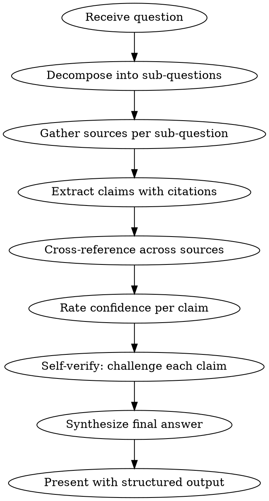

# research

Rigorous research workflow that minimizes hallucination using Anthropic's documented best practices. Every claim must be sourced, rated, and verified.

## Workflow



## Step 1: Decompose

Break the research question into 3-7 independent sub-questions. Each should be answerable on its own. This prevents compounding errors across a chain of reasoning.

## Step 2: Gather Sources

For each sub-question, use **all available tools** to find sources:

- **WebSearch** for current information, papers, docs
- **WebFetch** to read full pages found via search
- **Grep/Glob** for local codebase or file-based sources
- **Read** for local documents, PDFs, notebooks

**Rules:**
- Prefer primary sources over summaries
- Get at least 2 independent sources per sub-question when possible
- Store the full relevant passages — you'll need them for citations

## Step 3: Extract Claims with Citations

For each sub-question, extract factual claims from the gathered sources. Every claim MUST include:

```
CLAIM: [specific factual statement]
SOURCE: [URL, file path, or document name]
QUOTE: [exact verbatim quote supporting the claim]
```

**Rules:**
- Quote directly from source text — do NOT paraphrase
- If a claim cannot be grounded in a source, mark it as `SOURCE: None (from model knowledge)` — these get extra scrutiny in verification
- Separate what the sources say from your own inference

## Step 4: Cross-Reference

Compare claims across sources:

- Claims supported by 2+ independent sources: **CORROBORATED**
- Claims from only 1 source: **SINGLE-SOURCE** — flag for user
- Claims contradicted across sources: **DISPUTED** — present both sides

## Step 5: Rate Confidence

Rate each claim:

| Rating | Meaning |
|--------|---------|
| **HIGH** | Corroborated by multiple reliable sources with direct quotes |
| **MEDIUM** | Single reliable source with direct quote, or multiple sources without exact quotes |
| **LOW** | Model knowledge only, single unreliable source, or information near knowledge cutoff |
| **UNCERTAIN** | Contradicted across sources, or insufficient evidence — say so explicitly |

## Step 6: Self-Verify

Before synthesizing, challenge your own findings:

1. Re-read each LOW and UNCERTAIN claim — can you find better evidence? If not, drop or flag.
2. Check for leading assumptions — did the question embed false premises? Challenge them.
3. Check temporal validity — is this information potentially outdated given your knowledge cutoff?
4. Look for what's missing — what relevant sub-questions did you NOT ask?

## Step 7: Synthesize and Present

Present the final answer using this structure:

```markdown
## Research: [Topic]

### Summary
[2-3 sentence executive summary of findings]

### Findings

#### [Sub-question 1]
[Answer grounded in sources]

> "[exact quote]" — [source]

**Confidence:** HIGH/MEDIUM/LOW

#### [Sub-question 2]
...

### Disputed or Uncertain Claims
[List any DISPUTED or UNCERTAIN claims with both sides]

### Gaps and Limitations
- [What couldn't be verified]
- [What may be outdated]
- [What needs human verification]

### Sources
1. [Full source with URL/path]
2. ...
```

## Critical Rules

These rules are NON-NEGOTIABLE:

1. **Never fabricate a citation.** If you can't find a source, say so. Do not invent URLs, paper titles, author names, or quotes.
2. **Never present model knowledge as sourced fact.** If a claim comes from training data rather than a retrieved source, label it explicitly.
3. **Say "I don't know" when you don't know.** It is always better to have a gap than a hallucination.
4. **Flag your knowledge cutoff.** For time-sensitive topics, explicitly note that information may be outdated.
5. **Challenge the question's premises.** If the question contains assumptions, verify them rather than building on them.
6. **Prefer ranges over point estimates.** For numbers and dates you're uncertain about, give a range.
7. **Separate facts from inference.** When you reason beyond what sources say, mark it as inference.

## Red Flags — STOP and Re-examine

If you catch yourself doing any of these, stop and correct:

| Red Flag | What To Do |
|----------|------------|
| Writing a claim without a source | Find a source or mark as model knowledge |
| Paraphrasing instead of quoting | Go back and extract the exact quote |
| Saying "studies show" without naming the study | Find the specific study or remove the claim |
| Providing a specific number you're not sure about | Give a range or say uncertain |
| Building on an unverified premise from the question | Challenge the premise first |
| Rating everything as HIGH confidence | Re-examine — if everything is HIGH, you're not being critical enough |
| Skipping verification because "it's obviously true" | Obvious things are wrong surprisingly often — verify anyway |

## Techniques Applied

This workflow composes these Anthropic-documented anti-hallucination techniques:
- Sub-question decomposition (Step 1)
- Source grounding / RAG pattern (Step 2)
- Direct citation extraction (Step 3)
- Multi-source cross-referencing (Step 4)
- Confidence calibration (Step 5)
- Self-verification (Step 6)
- Structured output format (Step 7)
- Explicit "say I don't know" instructions (Critical Rules)
- Separating recall from reasoning (Steps 3 vs 7)
- Avoiding leading/suggestive premises (Critical Rules #5)
- Uncertainty ranges over point estimates (Critical Rules #6)
